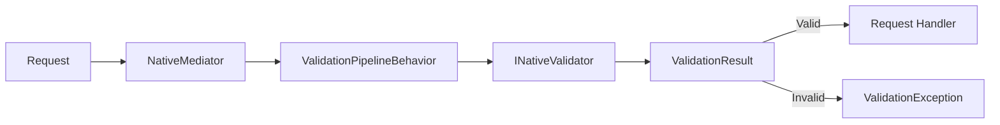

# Native.FluentValidation

High-performance fluent validation library built for **.NET 10 Native AOT**. No reflection, no expression trees, no runtime scanning — just predictable, compile-time-friendly rules.

[](https://www.nuget.org/packages/Native.FluentValidation/)
[](https://github.com/swepay/native-fluent-validation/actions/workflows/dotnet.yml)

## Features

- 🚀 **Native AOT Compatible** - Designed for trimming-safe, reflection-free validation
- ✅ **Fluent Rules** - Build rules with a predictable, compile-time API
- 🧩 **Explicit Property Names** - `RuleFor` requires `nameof(...)` for full AOT safety
- 🧱 **Built-in Rules** - `NotNull`, `NotEmpty`, `Length`, `GreaterThan`, `Must`, `Email`
- 🧠 **Rule Configuration** - `WithMessage`, `WithErrorCode`, `Cascade`, `When/Unless`
- 🔗 **NativeMediator Integration** - Pipeline validation with `ValidationPipelineBehavior`

## Installation

```bash
dotnet add package Native.FluentValidation
```

## Quick Start

### 1. Define a model and validator

```csharp
using Native.FluentValidation.Core;
using Native.FluentValidation.Builders;

public sealed class User
{
    public string? Email { get; set; }
    public int Age { get; set; }
}

public sealed class UserValidator : NativeValidator<User>
{
    public UserValidator()
    {
        RuleFor(x => x.Email, nameof(User.Email))
            .NotEmpty()
            .Email();

        RuleFor(x => x.Age, nameof(User.Age))
            .GreaterThan(17)
            .WithMessage("Age must be at least 18.");
    }
}
```

### 2. Validate an instance

```csharp
var validator = new UserValidator();
var result = validator.Validate(new User { Email = null, Age = 16 });

if (!result.IsValid)
{
    foreach (var error in result.Errors)
    {
        Console.WriteLine($"{error.PropertyName}: {error.ErrorMessage} ({error.ErrorCode})");
    }
}
```

### 3. Integrate with NativeMediator

```csharp
services.AddNativeFluentValidation<CreateUser, CreateUserValidator>();
```

When a validator is registered, the pipeline throws `ValidationException` on failure.

## Architecture



## Rule Builder API

```csharp
RuleFor(x => x.Name, nameof(User.Name))
    .NotEmpty()
    .Length(2, 100)
    .WithErrorCode("E_NAME")
    .WithMessage("Name is required.")
    .Cascade(CascadeMode.Stop)
    .When(x => x.IsActive);
```

### Available Rules

| Rule | Description |
|------|-------------|
| `NotNull()` | Fails when value is null |
| `NotEmpty()` | Fails when string/collection is empty |
| `Length(min, max)` | Validates length range |
| `GreaterThan(value)` | Validates value is greater |
| `Must(predicate)` | Custom predicate validation |
| `Email()` | Validates email format (string only) |

## Validation Results

`Validate` returns `ValidationResult`:

| Property | Type | Description |
|----------|------|-------------|
| `IsValid` | `bool` | `true` when no errors |
| `Errors` | `IReadOnlyList<ValidationFailure>` | List of failures |

Each `ValidationFailure` includes `PropertyName`, `ErrorCode`, and `ErrorMessage`.

## Conditional Validation

```csharp
RuleFor(x => x.Email, nameof(User.Email))
    .NotEmpty()
    .Email()
    .Unless(x => x.IsGuest);
```

## Requirements

- .NET 10.0 or later

## License

MIT License - see [LICENSE](LICENSE) for details.
